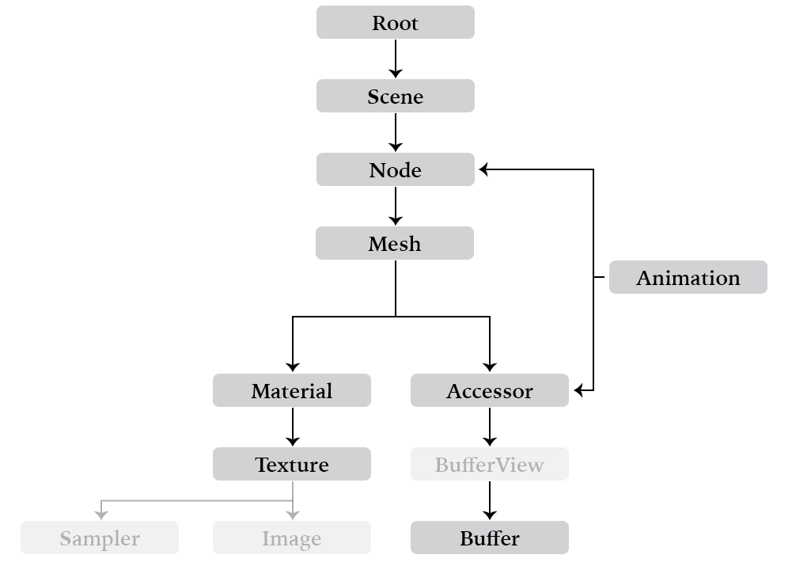

# Concepts

The glTF format defines high-level abstractions for concepts like scenes, nodes, meshes, and all other properties of a runtime 3D model. The [glTF 2.0 Quick Reference Guide](https://www.khronos.org/files/gltf20-reference-guide.pdf), provides a solid introduction to those concepts. A simplified overview (skipping some orthogonal details of animation, cameras, and lights) is presented here, for reference in writing scripts using the glTF-Transform APIs.

<figure>

<figcaption>
<em><strong>Figure:</strong> Concept diagram showing most of the glTF 2.0 format. Greyed-out properties (Sampler, Image, BufferView) are managed automatically (or nearly so) by the glTF-Transform API, and are not discussed in detail here.</em>
</figcaption>
</figure>

## Properties and references

In a runtime-ready glTF file, any properties available for use (and reuse) are listed in top-level JSON arrays at the root of the asset:

```js
{
  "scenes": [...],
  "meshes": [...],
  "materials": [...],
  "nodes": [...],
  ...
}
```

Throughout the asset, those properties are referenced by indices into the top-level array. For example, a node defined as `{"mesh": 0}` will instantiate the mesh found at index `0` of the top-level `meshes` array. These indexed arrays are useful for efficient loading, which is the primary goal of glTF 2.0, but are cumbersome for direct editing — which, to be fair, is generally the domain of interchange formats like COLLADA or USD.

In glTF-Transform, the conceptual model of these {@link Root}-level arrays is preserved, but all index-based pointers are managed by references and an internal graph structure, instead. For example, to list each {@link Mesh} available for reuse in a glTF document:

```typescript
doc.getRoot()
  .listMeshes()
  .forEach((mesh) => {
    console.log(mesh);
  });
```

Positions in root-level arrays are fluid until the final glTF file is written, and references to properties are given by passing objects directly:

```typescript
// Find an existing Mesh named 'Cog'.
const mesh = doc.getRoot()
  .listMeshes()
  .find((mesh) => mesh.getName() === 'Cog');

// Instantiate a copy of the 'Cog' mesh at a new node, 'CogInstance1'.
const cogNode = doc.createNode('CogInstance1')
  .setMesh(mesh);

// Add the Node to a Scene.
doc.listScenes()[0]
  .addChild(cogNode);

// List all references to the 'Cog' mesh.
mesh.listParents(); // → [cogNode, ...]
```

The same approach applies to any property that can hold references or be referenced within a glTF file. As the {@link Mesh} above can identify each {@link Node} that holds a reference to it, low-level properties like {@link Texture} and {@link Accessor} instances can similarly look up the locations in which they are used. A directed graph structure maintains these references automatically.

To remove all uses of a {@link Property}, simply `.detach()` or `dispose()` the object. Properties that are detached but not disposed are still exported, although — without any references to them from a {@link Scene} — you may need to write client logic to load them individually.

## Binary data

Similarly, the binary data in an exported glTF file is laid out tightly packed for GPU upload, with the JSON metadata of the file providing byte offsets and byte lengths for each vertex attribute or animation sampler. These byte offsets are described by Accessors and BufferViews. While this structure is ideal for efficient loading, it would normally present a challenge for directly editing a file: adding a single vertex to a Mesh might shift byte offsets used throughout the Buffer, requiring updates to any other Mesh or Animation referencing that Buffer.

glTF-Transform maintains the concept of an {@link Accessor}, but simplifies its use: the typed array is isolated during editing, and can be resized or deleted without affecting other data. Each Accessor has a reference to a {@link Buffer}, but that reference is only used to tell the exporter where to put the Accessor's data, when the model is finally written. Assigning Accessors to specific Buffers allows the data to be grouped for lazy-loading — if all Accessors for a specific Mesh are stored in an independent Buffer, the client does not need to fetch that Buffer until it needs to load that particular Mesh.

> **NOTICE:** The concept of a BufferView is not visible in glTF-Transform: the library creates an interleaved BufferView for each mesh at export, and automatically generates additional BufferViews for any remaining data.

To edit a Mesh vertex:

```typescript
// A Mesh may contain multiple Primitives, but in this case we only need to
// edit a particular vertex in the first Primitive.
const primitive = mesh.listPrimitives()[0];

// Find the Accessor storing vertex position data, and update the 10th vertex.
const positionAccessor = primitive.getAttribute('POSITION');
positionAccessor.setElement(10, [0, 0, 0]);
```

To allocate more vertices, or change the accessor type, replace its underlying array:

```typescript
// Make a copy of the Accessor's array, and allocate 100 empty vertices.
const prevArray = accessor.getArray();
const nextArray = new Float32Array(prevArray.length + 3 * 100);
nextArray.set(prevArray);

// Assign the modified array.
accessor.setArray(nextArray);
```

Most internal glTF properies are handled automatically when changing the array. In some cases (when setting uint- or int-typed arrays) you will need to pay attention to the glTF schema's allowed component types, and normalize your data where necessary. The KHR_mesh_quantization extension provides additional flexibility on data types.

For a deeper look at the glTF-Transform API, refer to the documentation for the {@link Document} class and its associated {@link Property} types.
