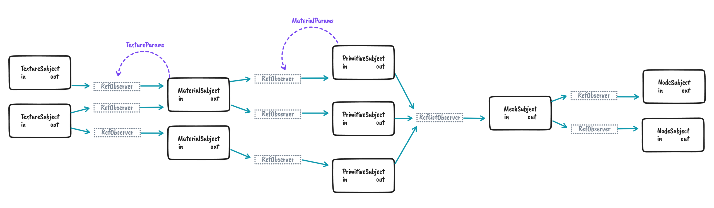

# Contributing

## Quickstart

```shell
# Install dependencies.
yarn

# Build source, watch for changes.
yarn watch

# Build source, watch for changes, and run examples.
yarn dev

# Run tests.
yarn test
```

## Concepts

The project is designed around a few common object types, loosely based on reactive programming patterns.

- **Subject:** Each glTF definition (e.g. `Material`) is bound to a single Subject (e.g. `MaterialSubject`).
    The Subject is responsible for receiving change events published by the definition, generating a
    derived three.js object (e.g. `THREE.Material`), and publishing the new value to all Observers. More
    precisely, this is a [*BehaviorSubject*](https://reactivex.io/documentation/subject.html), which holds
    a single current value at any given time.
- **Observer:** An Observer is subscribed to the values published by a particular Subject, and
    passes those events along to a parent — usually another Subject. For example, a MaterialSubject
    subscribes to updates from a TextureSubject using an Observer. Observers are parameterized:
    for example, a single Texture may be used by many Materials, with different offset/scale/encoding
    parameters in each. The TextureSubject treats each of these Observers as a different "output", and
    uses the parameters associated with the Observer to publish the appropriate value. This library
    implements three observer types: `RefObserver`, `RefListObserver`, and `RefMapObserver`; the latter
    two are collections of `RefObservers` used to collate events from multiple Subjects (e.g. lists of Nodes).
- **Pool:** As Subjects publish many variations of the same values to Observers, it's important to
    allocate those variations efficiently, reuse instances where possible, and clean up unused
    instances. That bookkeeping is assigned to Pools (not a Reactive concept).

The diagram below shows a subset of the data flow sequence connecting Texture, Material, Primitive, and Node
data types.


